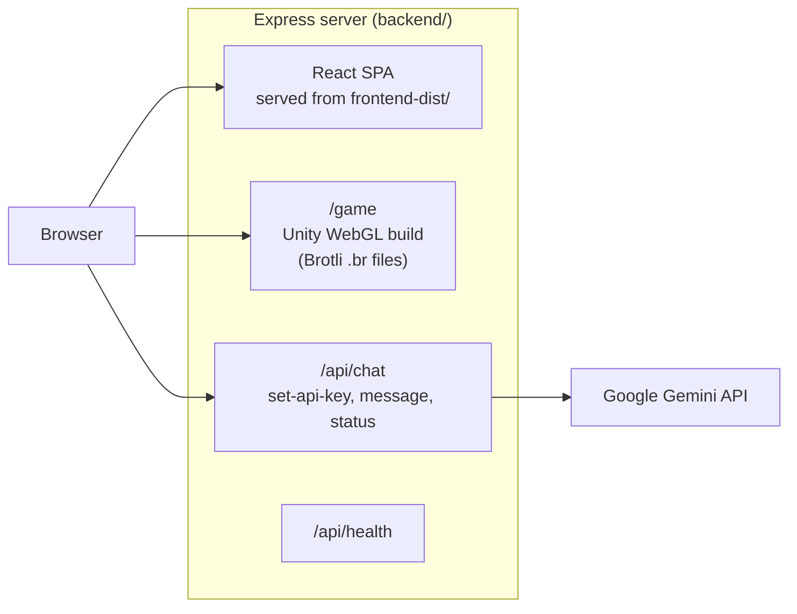

# Artemis+ Lunar Habitat Simulator

**An interactive planner for long-duration lunar habitats, built for NASA Space Apps Challenge 2025.** Artemis+ pairs a Unity WebGL simulation, where you lay out and manage a base at the lunar south pole, with a web app that documents the habitat systems and a Gemini-powered mission assistant that answers questions while you play.


> **Live demo:** the Railway deployment at https://nsac-2025-production.up.railway.app is currently offline. Run it locally with the steps below.

---

## What it does

- **Web simulation.** A Unity WebGL build embedded in the site, with four missions: habitat layout (drag modules into place while the game enforces habitability rules, for example flagging a crew fatigue risk when comms sit too close to bunks), mission setup (crew size, duration, location), habitat customization, and colony management on a 3D lunar surface.
- **Habitat reference.** Pages covering the mission scope (crew of 16 to 32, 30 to 180+ day scenarios, south-pole site), the core systems (air and life support, water recovery, vertical greenhouses, power, communications, recycling), top failure modes and fixes, and the methods, materials and data sources behind the numbers.
- **Mission assistant.** A chat panel backed by Google Gemini (`gemini-2.5-flash`). The prompt carries the game controls and all four mission designs, so answers stay on habitat layout, crew and resource planning.
- **Local version and documentation.** The landing page links a local version of the simulation and the team's data and design document.

---

## Architecture



One Node process serves everything in production. `build-for-production.js` builds the Vite frontend and copies it into `backend/frontend-dist`. Express serves the SPA (no-store on `index.html`, immutable caching on hashed assets), serves the Unity build under `/game` with the right `Content-Encoding: br` headers, and proxies chat requests to Gemini. `railway.json` builds with Nixpacks and health-checks `/api/health`.

---

## Tech stack

- **Frontend:** React 19, TypeScript, Vite 7, lucide-react, react-markdown, Axios
- **Backend:** Node.js 20, Express, TypeScript, `@google/generative-ai`
- **Simulation:** Unity 2022.3 (LTS), exported to WebGL
- **Deploy:** Railway (Nixpacks)

---

## Run it locally

Requires Node 20.19+ (see `.nvmrc`) and a Google Gemini API key from [Google AI Studio](https://aistudio.google.com/app/apikey) for the chat panel.

```bash
# install root (concurrently), frontend and backend dependencies
npm install
npm run install-all

# start backend (http://localhost:5000) and frontend (http://localhost:3000) together
npm run dev
```

Open http://localhost:3000. The Vite dev server proxies `/api` and `/game` to the backend. To use the assistant, open the chat panel, paste your Gemini key and click **Set API Key**.

**Production build** (what Railway runs):

```bash
node build-for-production.js
npm start          # serves the app, API and game on $PORT (default 5000)
```

The Unity WebGL build must be present in `backend/public/Build/` for the simulation to load. It is committed, so the web app runs without opening Unity. The Unity project source is in `unity_codebase/`; to open or rebuild it, first import the packages listed under [Third-party assets](#third-party-assets-buy-or-import-separately).

### API

| Method | Path | Purpose |
|---|---|---|
| GET | `/api/health` | Health check |
| GET | `/api/frontend-version` | Short hash of the served `index.html` (deploy diagnostic) |
| GET | `/game` | Unity WebGL build |
| POST | `/api/chat/set-api-key` | Set the Gemini key |
| POST | `/api/chat/message` | Ask the assistant (`message`, optional `gameState`) |
| GET | `/api/chat/status` | Whether a key is set |

---

## Project structure

```
artemis-plus-lunar-habitat-simulator/
├── frontend/                 React + TypeScript app (Vite)
│   └── src/components/       LandingPage, AboutPage, MissionPage, SystemsPage,
│                             MethodsPage, DataDesignPage, GamePanel, ChatPanel, Navbar
├── backend/                  Express server
│   ├── src/index.ts          static serving, caching, health and version endpoints
│   ├── src/routes/chat.ts    Gemini chat routes
│   └── public/               Unity WebGL build served at /game
├── unity_codebase/           Unity project for the simulation (Asset Store packages not included)
├── build-for-production.js   builds the frontend and copies it into backend/
└── railway.json              Railway build and deploy config
```

---

## Known limitations

- The Gemini key is held in server memory and shared by every visitor of one server process. It is fine for a local demo; a multi-user deployment would need per-session keys.
- The assistant does not receive live game state from the Unity build yet (the API accepts `gameState`, but the frontend sends `null`).

---

## Third-party assets (buy or import separately)

The Unity project in `unity_codebase/` was built with the Unity Asset Store packages below. Their licenses do not allow redistributing the package files, so they are not in this repository and are listed in `.gitignore`. Without them the web app and the committed WebGL build still work, but opening `unity_codebase/` in Unity shows missing scripts, prefabs and materials in the scenes that use them. That is expected.

| Package | Folder it goes in | Cost | Source |
|---|---|---|---|
| PDF Renderer by Paroxe | `Assets/Paroxe/` | Paid, buy on the Unity Asset Store | Asset Store listing "PDF Renderer" (publisher Paroxe) |
| Shift - Complete Sci-Fi UI (v2.0.10) by Michsky | `Assets/External Assets/Shift - Complete Sci-Fi UI/` | Paid, buy on the Unity Asset Store | Publisher site from the package readme: https://www.michsky.com |
| Digger (terrain caves and overhangs), shader packages only | `Assets/Digger/Shaders/` | Paid, buy on the Unity Asset Store | Asset Store listing "Digger" |
| MPUIKit (Modern Procedural UI Kit) by Scrollbie | `Assets/External Assets/MPUIKit/` | Edition not identifiable from the files; check the Asset Store listing | Docs linked from the package readme: https://scrollbie.com/documentations/mpuikit-docs/ |
| Moon environment pack (terrain, lens flares, image effects) | `Assets/External Assets/Moon/` | Publisher and price not identifiable from the files | Name only |
| Mini First Person Controller | `Assets/Mini First Person Controller/` | Free on the Unity Asset Store (license does not allow reposting) | Name only |
| Yughues Free Sand Materials | `Assets/YughuesFreeSandMaterials/` | Free on the Unity Asset Store (license does not allow reposting) | Name only |

**Import steps**

1. Open `unity_codebase/` in Unity 2022.3 (the project was made with 2022.3.62f1).
2. Sign in to your Unity account, then buy or claim each package above on the Unity Asset Store so it appears in **Window > Package Manager > My Assets**.
3. In Package Manager, download and **Import** each package. Keep the full import list checked.
4. Place each imported folder at the path in the table, relative to `unity_codebase/`, moving it inside Unity's Project window if it imported elsewhere (Shift, Moon and MPUIKit go under `Assets/External Assets/`). Unity links scenes to assets by the GUIDs in the packages' `.meta` files, and keeping these paths also keeps the folders covered by `.gitignore`.
5. For Digger, import the shader `.unitypackage` that matches your render pipeline (URP or HDRP, version 12-14 or 17) from `Assets/Digger/Shaders/`.
6. Open the scenes in `Assets/_Scenes/` (`Lunar South`, `Habitats`) and check the Console for any remaining missing references.

---

## License

The team's own code and assets are MIT licensed; see [`LICENSE`](LICENSE). The MIT grant does not cover the Asset Store packages above, which you must obtain under their own licenses, or the third-party components that remain in the repository (Noto Color Emoji, Unity Starter Assets, TextMesh Pro), which are listed with their licenses in [`THIRD_PARTY_NOTICES.md`](THIRD_PARTY_NOTICES.md).

---

## Event

Built during NASA Space Apps Challenge 2025 (October 2025).
