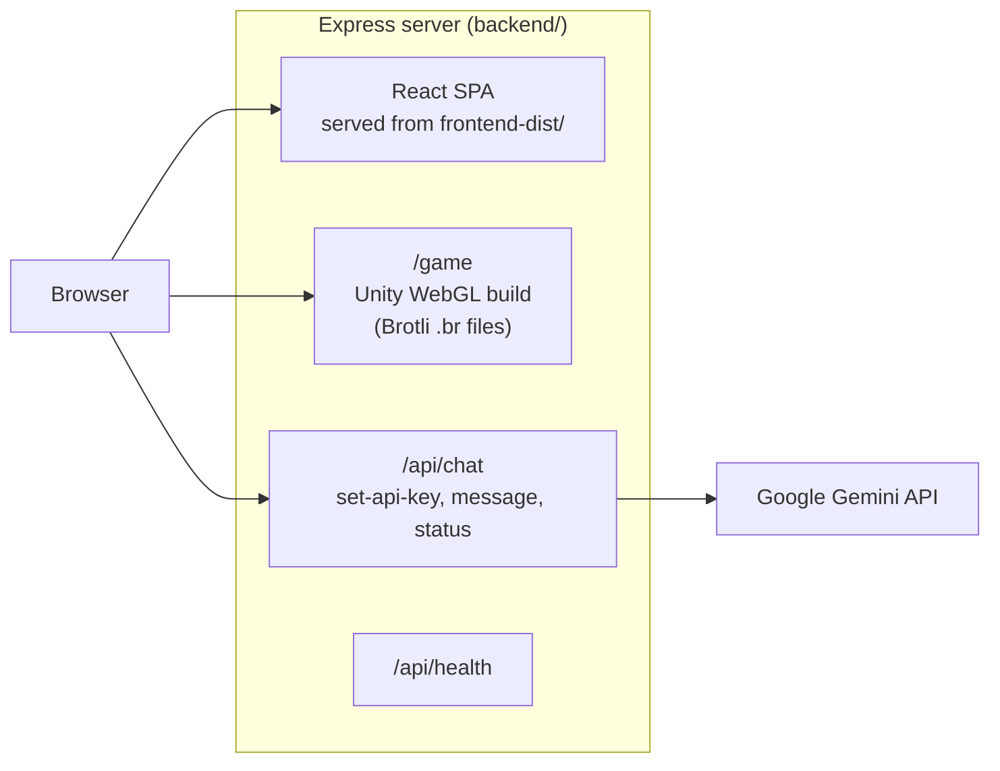

# Artemis+ Lunar Habitat Simulator

**An interactive planner for long-duration lunar habitats, built for NASA Space Apps Challenge 2025.** Artemis+ pairs a Unity WebGL simulation, where you lay out and manage a base at the lunar south pole, with a web app that documents the habitat systems and a Gemini-powered mission assistant that answers questions while you play.


> **Live demo:** the Railway deployment at https://nsac-2025-production.up.railway.app is currently offline. Run it locally with the steps below.

---

## What it does

- **Web simulation.** A Unity WebGL build embedded in the site, with four missions: habitat layout (drag modules into place while the game enforces habitability rules, for example flagging a crew fatigue risk when comms sit too close to bunks), mission setup (crew size, duration, location), habitat customization, and colony management on a 3D lunar surface.
- **Habitat reference.** Pages covering the mission scope (crew of 16 to 32, 30 to 180+ day scenarios, south-pole site), the core systems (air and life support, water recovery, vertical greenhouses, power, communications, recycling), top failure modes and fixes, and the methods, materials and data sources behind the numbers.
- **Mission assistant.** A chat panel backed by Google Gemini (`gemini-2.5-flash`). The prompt carries the game controls and all four mission designs, so answers stay on habitat layout, crew and resource planning.
- **Local version and documentation.** The landing page links a local version of the simulation and the team's data and design document.

---

## Architecture



One Node process serves everything in production. `build-for-production.js` builds the Vite frontend and copies it into `backend/frontend-dist`. Express serves the SPA (no-store on `index.html`, immutable caching on hashed assets), serves the Unity build under `/game` with the right `Content-Encoding: br` headers, and proxies chat requests to Gemini. `railway.json` builds with Nixpacks and health-checks `/api/health`.

---

## Tech stack

- **Frontend:** React 19, TypeScript, Vite 7, lucide-react, react-markdown, Axios
- **Backend:** Node.js 20, Express, TypeScript, `@google/generative-ai`
- **Simulation:** Unity 2022.3 (LTS), exported to WebGL
- **Deploy:** Railway (Nixpacks)

---

## Run it locally

Requires Node 20.19+ (see `.nvmrc`) and a Google Gemini API key from [Google AI Studio](https://aistudio.google.com/app/apikey) for the chat panel.

```bash
# install root (concurrently), frontend and backend dependencies
npm install
npm run install-all

# start backend (http://localhost:5000) and frontend (http://localhost:3000) together
npm run dev
```

Open http://localhost:3000. The Vite dev server proxies `/api` and `/game` to the backend. To use the assistant, open the chat panel, paste your Gemini key and click **Set API Key**.

**Production build** (what Railway runs):

```bash
node build-for-production.js
npm start          # serves the app, API and game on $PORT (default 5000)
```

The Unity WebGL build must be present in `backend/public/Build/` for the simulation to load. The Unity project source is in `unity_codebase/`.

### API

| Method | Path | Purpose |
|---|---|---|
| GET | `/api/health` | Health check |
| GET | `/api/frontend-version` | Short hash of the served `index.html` (deploy diagnostic) |
| GET | `/game` | Unity WebGL build |
| POST | `/api/chat/set-api-key` | Set the Gemini key |
| POST | `/api/chat/message` | Ask the assistant (`message`, optional `gameState`) |
| GET | `/api/chat/status` | Whether a key is set |

---

## Project structure

```
NSAC-2025/
├── frontend/                 React + TypeScript app (Vite)
│   └── src/components/       LandingPage, AboutPage, MissionPage, SystemsPage,
│                             MethodsPage, DataDesignPage, GamePanel, ChatPanel, Navbar
├── backend/                  Express server
│   ├── src/index.ts          static serving, caching, health and version endpoints
│   ├── src/routes/chat.ts    Gemini chat routes
│   └── public/               Unity WebGL build served at /game
├── unity_codebase/           Unity project for the simulation
├── build-for-production.js   builds the frontend and copies it into backend/
└── railway.json              Railway build and deploy config
```

---

## Known limitations

- The Gemini key is held in server memory and shared by every visitor of one server process. It is fine for a local demo; a multi-user deployment would need per-session keys.
- The assistant does not receive live game state from the Unity build yet (the API accepts `gameState`, but the frontend sends `null`).

---

## Event

Built during NASA Space Apps Challenge 2025 (October 2025).
